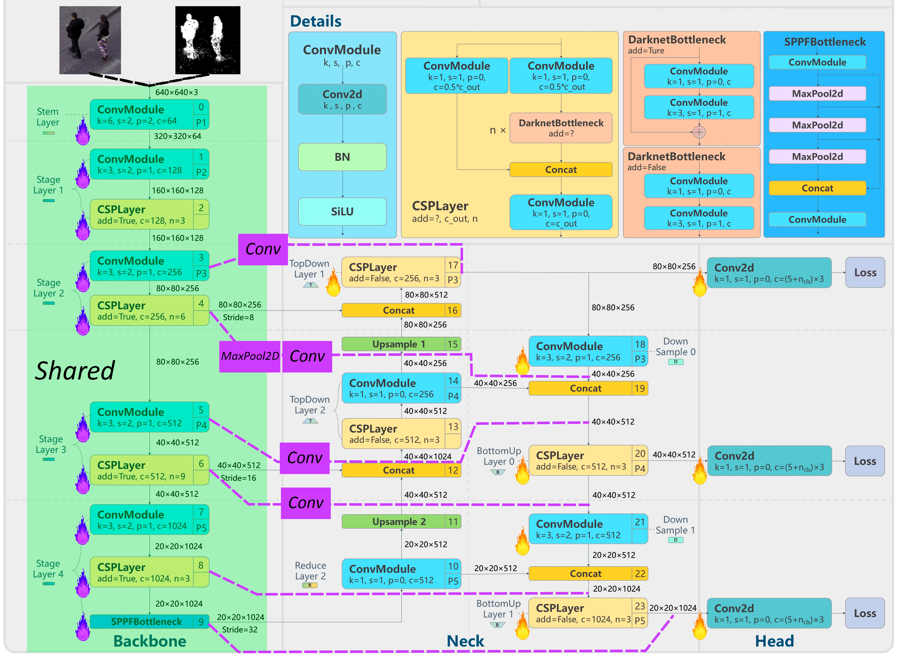

# YOLOv5-Motion: Enhanced Object Detection with Motion Context

YOLOv5-Motion is a novel approach to object detection that integrates motion context into the popular YOLOv5 architecture using ControlNet and LoRA (Low-Rank Adaptation) techniques. This repository contains the implementation for training and deploying motion-enhanced object detectors that can significantly improve detection performance in video content.

## Features

- **Motion-Enhanced Detection**: Leverages temporal information from videos to improve detection accuracy
- **Multiple Motion Representations**:
  - Optical Flow - Captures detailed motion vectors between frames
  - Background Subtraction - Isolates moving objects from static backgrounds
  - Frame Differencing - Simple but efficient change detection
  - Mixed Mode - Combines multiple approaches for better results
- **Efficient Architecture**:
  - ControlNet integration for conditioning YOLOv5 on motion cues
  - LoRA fine-tuning for parameter-efficient training
  - Modular design allowing for various backbone models
- **Comprehensive Tools**:
  - Training pipeline with visualization and monitoring
  - Testing and evaluation framework with detailed metrics
  - Performance analysis and comparison utilities

## Architecture

The YOLOv5-Motion architecture consists of three main components:

1. **Base YOLOv5 Model**: Standard YOLOv5 object detector (supports various sizes: n/s/m/l/x)
2. **ControlNet**: Conditioning network that processes motion information and influences the base model
3. **Motion Preprocessing**: Generates control images from sequential video frames



### Motion Representation Methods

Different methods are implemented for representing motion:

- **Optical Flow**: Uses Farneback algorithm to calculate motion vectors between frames
- **Background Subtraction**: Uses KNN-based background modeling to isolate moving objects
- **Frame Differencing**: Simple subtraction between consecutive frames to detect changes
- **Mixed Mode**: Combines multiple approaches for robust motion representation

## Installation

```bash
# Clone YOLOv5 repository (required dependency)
git clone https://github.com/ultralytics/yolov5.git

# Clone this repository
git clone https://github.com/Crized-bit/YOLOv5_ControlNet_Motion.git
cd YOLOv5_ControlNet_Motion

# Install dependencies
pip install -r requirements.txt

# Install the package in development mode
pip install -e .
```

## Usage

### Data Preparation

```python
from yolov5_motion.data.preprocessing import preprocess_videos

# Process videos to extract frames and generate control images
preprocess_videos(
    videos_dir="/path/to/videos",
    annotations_dir="/path/to/annotations",
    output_dir="/path/to/output",
    control_mode="bg_subtraction",  # Options: "flow", "bg_subtraction", "difference", "mixed"
)
```
All data should be in [PersonPath22](https://amazon-science.github.io/tracking-dataset/personpath22.html) format! You can download dataset from [their official repo](https://github.com/amazon-science/tracking-dataset).
### Training

```python
from yolov5_motion.train import main as train_main

# Train a model with default parameters
train_main()

# Training can also be customized via config.py or command line
```

### Testing

```python
from yolov5_motion.test import test

# Test the model and generate metrics
test_metrics = test()

# Results will be saved to the output directory specified in config
```

## Configuration

The system is configured via the `config.py` file, which contains settings for:

- Data paths and preprocessing
- Model architecture and weights
- Training hyperparameters
- Testing configuration

Example configuration:

```python
@dataclass
class A100OptimizedYOLOv5Config:
    data: DataConfig = field(default_factory=DataConfig)
    model: ModelConfig = field(default_factory=ModelConfig)
    training: TrainingConfig = field(default_factory=TrainingConfig)
    test_epoch: int = 0
    control_scale: float = 1.0

# Default configuration
my_config = A100OptimizedYOLOv5Config()
```

## Results

Our experiments show that adding motion context via ControlNet significantly improves detection metrics:

### Performance Comparison

| Model | mAP@0.5 | mAP@0.5:0.95 |
|-------|---------|--------------|
| YOLOv5n Base | 0.4523 | 0.2493 |
| YOLOv5n + LoRA | 0.6197 | 0.3228 |
| YOLOv5n + Background Subtraction | 0.6188 | 0.3193 |
| YOLOv5n + Fame Difference | 0.6193 | 0.3264 |
| YOLOv5n + Mixed Mode | 0.6231 | 0.3157 |

### Inference Speed on A100

| Model Configuration | FPS (640×640) | Latency (ms) |
|---------------------|---------------|--------------|
| YOLOv5n Base | ≈ 140 | ≈ 7.2 |
| YOLOv5n + LoRA | ≈ 140 | ≈ 7.2 |
| YOLOv5n + LoRA + ControlNet (Fused) | ≈ 85 | ≈ 11.9 |
| YOLOv5n + LoRA + ControlNet (Shared) | ≈ 65 | ≈ 16.1 |

## Citation

If you use this code for your research, please cite our work:

```
@misc{yolov5_motion,
  author = {Kudrevatyh P.S.},
  title = {YOLOv5-Motion: Enhanced Object Detection with Motion Context},
  year = {2025},
  publisher = {GitHub},
  journal = {GitHub repository},
  howpublished = {\url{https://github.com/Crized-bit/YOLOv5_ControlNet_Motion}}
}
```

## License

This project is licensed under the MIT License - see the LICENSE file for details.

## Acknowledgments

- The YOLOv5 implementation is based on [Ultralytics YOLOv5](https://github.com/ultralytics/yolov5)
- ControlNet concept is inspired by [LDM-ControlNet](https://github.com/lllyasviel/ControlNet)
- LoRA implementation uses [PEFT library](https://github.com/huggingface/peft)